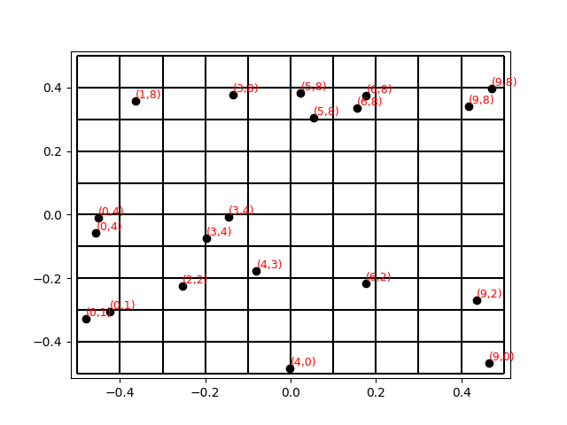

# Grids
Grids is a Python package designed to partition space into grid elements and perform operations on tensor quantities assigned to each grid element. It facilitates the computation of tensor averages within each element, making it well-suited for spatial data analysis.

## Installation

You can install Grids using pip:

```bash
pip install -e "git+https://github.com/marcos1561/grids.git/#egg=texture"
```

## Quick Start

### Creating Grids
Grids can be created passing a configuration object to a grid object, for instance, let's create a regular rectangular grid in two dimensions
```python
import grids

grid_cfg = grids.RegularRectGridCfg(
    length=1, height=1,
    num_cols=10, num_rows=10,
    center=(0, 0),
)

grid = grids.RegularRectGrid(grid_cfg)
```
for convenience, one can use the method `.get_grid()` of a grid configuration object to get the grid  
```python
import grids

grid = grids.RegularRectGridCfg(
    length=1, height=1,
    num_cols=10, num_rows=10,
    center=(0, 0),
).get_grid()
```

### Calculating points grid coordinates
Given an array of points, one can calculate its coordinates in a grid very easily
```python
import grids

# Creating the grid
grid = grids.RegularRectGridCfg(
    length=1, height=1,
    num_cols=10, num_rows=10,
    center=(0, 0),
).get_grid()

# Generating random points inside the grid
points = grid.random_points(10) 

# Calculating grid coordinates
points_coords = grid.coords(points)
```
the lower left grid cell has coordinate `(0, 0)`.

### Calculating averages in each grid cell
Suppose we have a list of a tensor quantity named `values`, that is, values in an array with shape (n# of values, shape of the values), for instance, if we have a list of 100 vectors in 2D, `values.shape = (100, 2)`. Also suppose that each element in `values` is associated with a position in the variable `position`. With that data, one can calculate the average of `values` in each grid cell as follows
```python
import grids

grid = ... # Creating the grid

coords = grid.coords(position)
values_grid_mean = grid.mean_by_cell(values, coords)
```
`values_grid_mean` in an array with shape (in 2D) (n# of grid rows, n# of grid columns, shape of a single value), for example, `values_grid_mean[0, 0]` is the mean value in the grid cell at the lower left corner. 

> OBS: The grid cell with coordinate `(x, y)` is accessed inverting the coordinates, that is, `values_grid_mean[y, x]` is the mean value at coordinate `(x, y)` in the grid. This convention was adopted to play nicely with `matplotlib` an some `numpy` functions. 

### Visualization
A grid can be visualized
```python
import grids

grid = grids.RegularRectGridCfg(
    length=1, height=1,
    num_cols=10, num_rows=10,
    center=(0, 0),
).get_grid()

import matplotlib.pyplot as plt
grid.plot_grid(plt.gca())
plt.show()
```
> See other methods that starts with `plot` to plot other aspects of the grid.

a particular useful visualization method is `.debug_points()`, which plots a list of points with their grid coordinates.
```python
import grids

grid = grids.RegularRectGridCfg(
    length=1, height=1,
    num_cols=10, num_rows=10,
    center=(0, 0),
).get_grid()

points = grid.random_points(10)

import matplotlib.pyplot as plt
ax = plt.gca()

grid.debug_points(ax)
grid.plot_grid(ax)
plt.show()
```
the above code will produce the following image



## Contributing

Contributions are welcome! If you'd like to contribute, please follow these steps:

1. Fork the repository.
2. Create a new branch for your feature or bugfix.
3. Commit your changes and push the branch.
4. Submit a pull request.

Please ensure your code adheres to the project's coding standards and includes tests where applicable.
